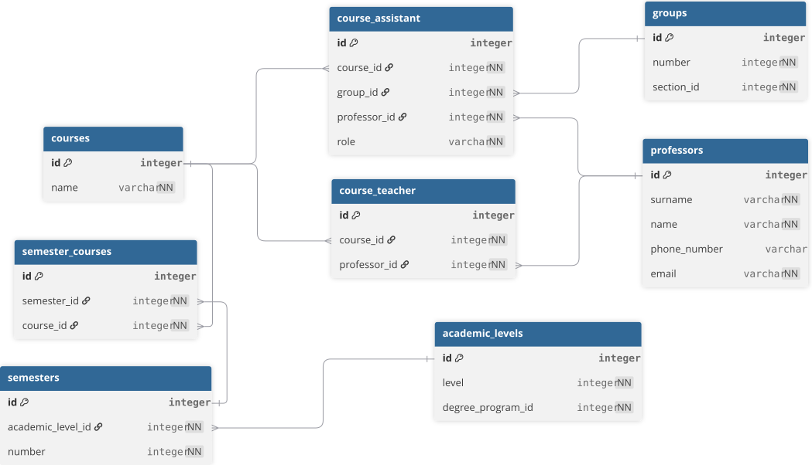

# 1. Pedagogical Structure

We mean by 'pedagogical' the hierarchy of groupings that students are managed with.

The hierarchical nature of the structure makes for a straightforward model. A specialty has academic levels that each contain sections which are in turn also divided in groups.

	

# 2. Academic Structure

Courses are handled with a classical many-to-many, with each academic level having two semesters. Professors can be in charge of a course (a.k.a. a teacher) or an assist in TPs and/or TDs are in charge of a TP and/or TD and are course-specific.

	

