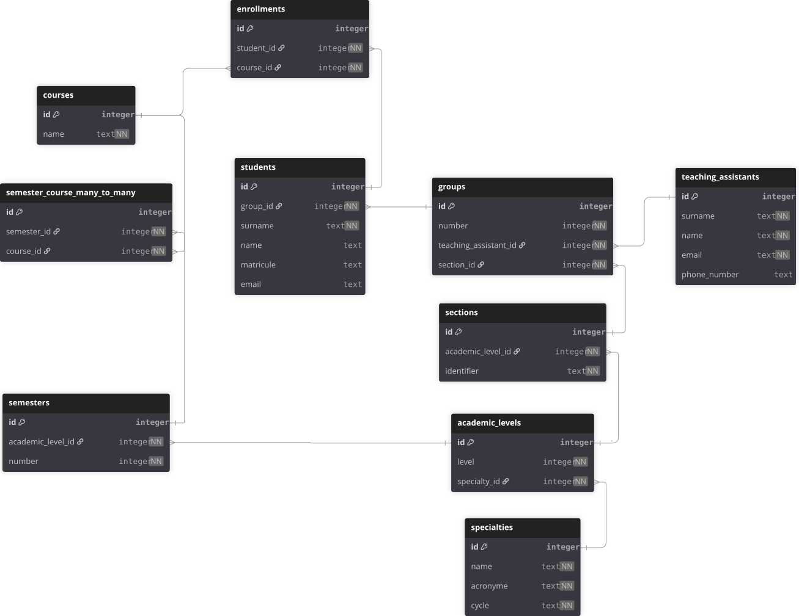

## ⁠1. TL;DR

<div align="center">
	
</div>

```dbml
Table academic_levels {

id integer [pk, increment]

level integer [not null]

specialty_id integer [not null]

}

Ref: academic_levels.specialty_id > specialties.id

  

Table courses {

id integer [pk, increment]

name text [not null]

}

  

Table enrollments {

id integer [pk, increment]

student_id integer [not null]

course_id integer [not null]

}

  

Table groups {

id integer [pk, increment]

number integer [not null]

teaching_assistant_id integer [not null]

section_id integer [not null]

}

  

Table sections {

id integer [pk, increment]

academic_level_id integer [not null]

identifier text [not null]

}

  

Table semester_course_many_to_many {

id integer [pk, increment]

semester_id integer [not null]

course_id integer [not null]

}

  

Table semesters {

id integer [pk, increment]

academic_level_id integer [not null]

number integer [not null]

}

  

Table specialties {

id integer [pk, increment]

name text [not null]

acronyme text [not null]

cycle text [not null]

}

  

Table students {

id integer [pk, increment]

group_id integer [not null]

surname text [not null]

name text

matricule text

email text

}

  

Table teaching_assistants {

id integer [pk, increment]

surname text [not null]

name text [not null]

email text [not null]

phone_number text

}

  

Ref: enrollments.course_id > courses.id

Ref: enrollments.student_id > students.id

Ref: groups.section_id > sections.id

Ref: groups.teaching_assistant_id > teaching_assistants.id

Ref: sections.academic_level_id > academic_levels.id

Ref: semester_course_many_to_many.course_id > courses.id

Ref: semester_course_many_to_many.semester_id > semesters.id

Ref: semesters.academic_level_id > academic_levels.id

Ref: students.group_id > groups.id
```

# ⁠2. Pedagogical Structure

The structure is pretty straightforward. A specialty has academic levels with sections which are in turn also divided in groups. Each group must have a teaching assistant.

## ⁠2.1. Student

| Column       |  Type  | Explanation                                                                  | Nullable |
| ------------ | :----: | ---------------------------------------------------------------------------- | -------- |
| name         |  TEXT  | duh                                                                          | NO       |
| surname      |  TEXT  | duh                                                                          | NO       |
| matricule    |  TEXT  | duh                                                                          | NO       |
| email        |  TEXT  | useful to keep track of                                                      | YES      |
| **group_id** | **FK** | **the group subsequently point to the section and specialty of the student** | **NO**   |

## ⁠2.2. Group

| Column                   | Type   | Explanation                                                    | Nullable |
| ------------------------ | ------ | -------------------------------------------------------------- | -------- |
| number                   | INT    | group number with the section                                  | NO       |
| **section_id**           | **FK** | **pointing to the section which just aggregates groups**       | **NO**   |
| **teachingAssistant_id** | **FK** | **each group must have a TA, but one is not always available** | **YES**  |

## ⁠2.3. Section

| Column                | Type   | Explanation                                                              | Nullable |
| --------------------- | ------ | ------------------------------------------------------------------------ | -------- |
| number                | INT    | the section number                                                       | NO       |
| **academic_level_id** | **FK** | **each level has different sections for all the students in that level** | **NO**   |

## ⁠2.4. Academic Level

| Column           | Type   | Explanation                                                  | Nullable |
| ---------------- | ------ | ------------------------------------------------------------ | -------- |
| number           | INT    | first year, second year, ... (the cycle isn't included here) | **NO**   |
| **specialty_id** | **FK** | **Each specialty will be divided in have levels (years)**    | **NO**   |

## ⁠2.5. Specialty

| Column   | Type | Explanation                                                                | Nullable |
| -------- | ---- | -------------------------------------------------------------------------- | -------- |
| name     | TEXT | specialty name e.g. "Intelligence Artificiel" or "Science et Technologies" | NO       |
| acronyme | TEXT | an abreviation of the name e.g. "AI" or "GL" for "Genie Logiciel"          | NO       |
| cycle    | TEXT | wether it's a Masters specialty or a Licence one                           | NO       |

## ⁠2.6. Teaching Assistant

| Column      | Type | Explanation                                    | Nullable |
| ----------- | ---- | ---------------------------------------------- | -------- |
| name        | TEXT | duh                                            | NO       |
| surname     | TEXT | duh                                            | NO       |
| email       | TEXT | duh                                            | NO       |
| phoneNumber | TEXT | maybe? It would be useful we could annoy them! | YES      |

# ⁠3. Curriculum Structure

Now this is where things start getting tricky. Each student is enrolled in many courses at the same time which belong to a semester. A specialty's curriculum is defined by the semesters that compose the specialty.

It would seem at first that we can just enroll student in the courses that belong in the current semester but there are also students who are retaking courses which do not belong in the semester they are currently studying in. So the enrollment can't depend solely on the current semester.

A given course isn't specific to one semester either, so we'll need a Many-to-Many table for that too.

Now a professor should obviously work on the courses within the *current* semester. So we must automatically enroll students in all of the courses of the current semester that they should be enrolled in according to their group's specialty and academic level.g

## 3.1. Enrollment

| Column         | Type   | Explanation                                    | Nullable |
| -------------- | ------ | ---------------------------------------------- | -------- |
| **student_id** | **FK** | **student enrolled in the course**             | **NO**   |
| **course_id**  | **FK** | **course in which the student in enrolled in** | **NO**   |
## 3.2. Course


| Column | Type | Explanation | Nullable |
| ------ | ---- | ----------- | -------- |
| name   | TEXT | Course name | NO       |

## 3.3. SemesterCourse

| Column          | Type   | Explanation                             | Nullable |
| --------------- | ------ | --------------------------------------- | -------- |
| **course_id**   | **FK** | **course that belong to that semester** | **NO**   |
| **semester_id** | **FK** | **semester in question**                | **NO**   |

# 4. Grading

Let's not worry about that for now